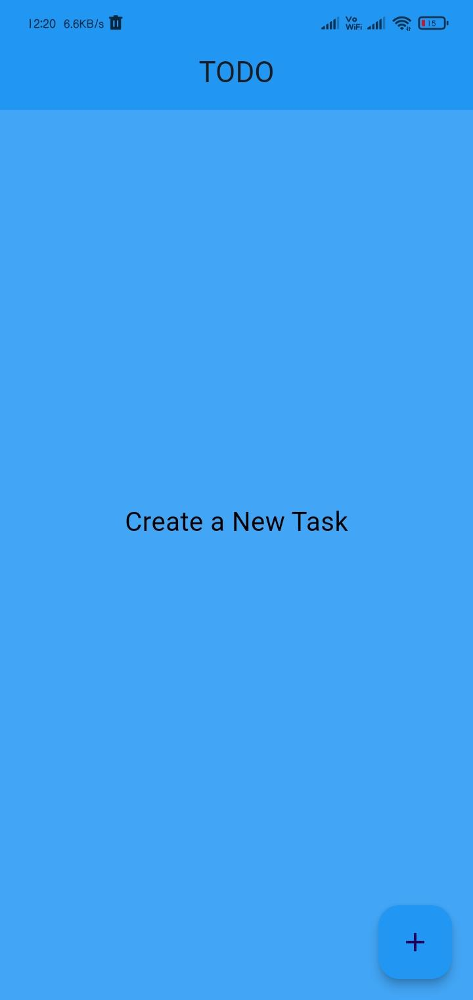
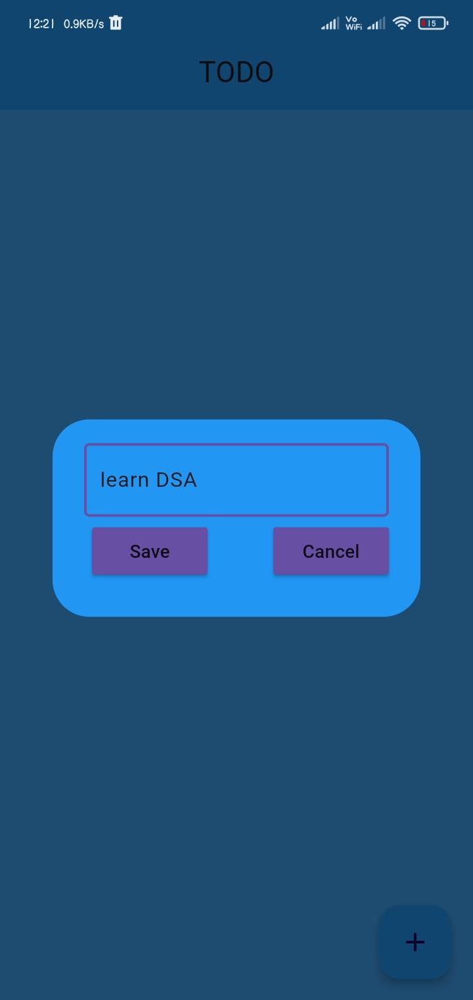
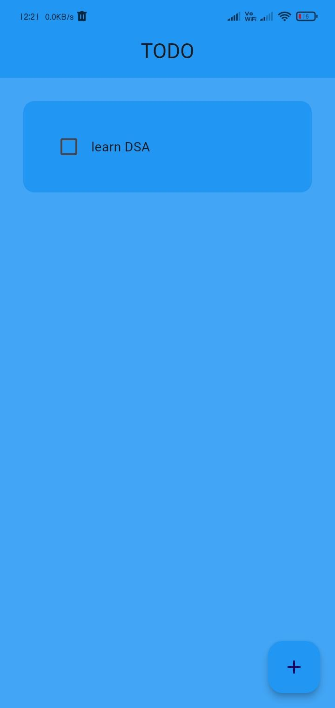
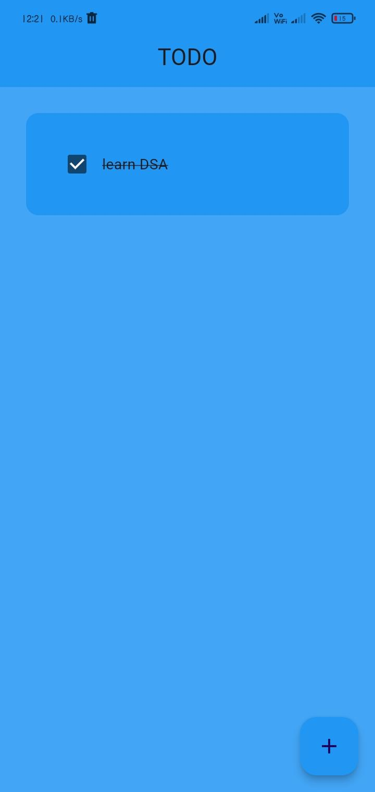
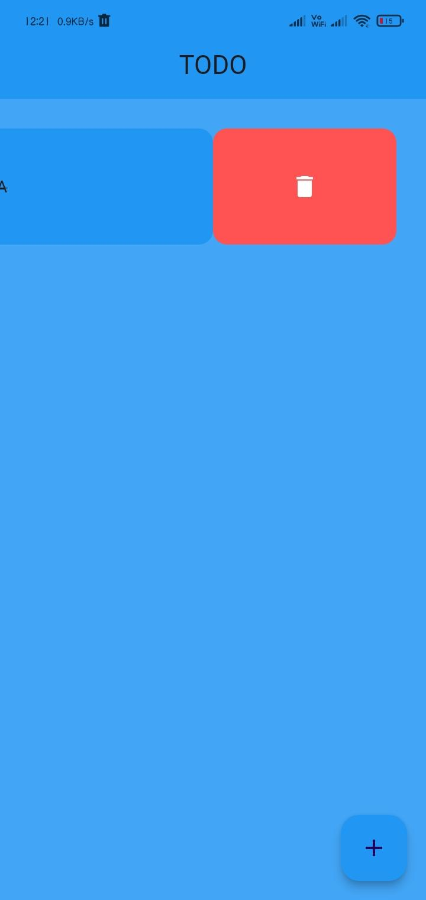

# Simple To-Do App

This is a simple to-do application built with Flutter, utilizing **Hive** local storage to store tasks. The app allows users to add, mark as finished, and delete tasks with a simple, user-friendly interface.

## Features:
- **Add Task**: Users can add new tasks .
- **Finish Task**: Tasks can be marked as finished, allowing users to track completed tasks.
- **Delete Task**: Tasks can be deleted from the list when no longer needed.
- **Persistent Data**: Tasks are stored locally on the device using **Hive**, so they persist even when the app is closed.

## Technologies Used:
- **Flutter** for building the mobile app.
- **Dart** for the programming language.
- **Hive** for local storage.
- **GitHub** for version control.

## Screenshots:

